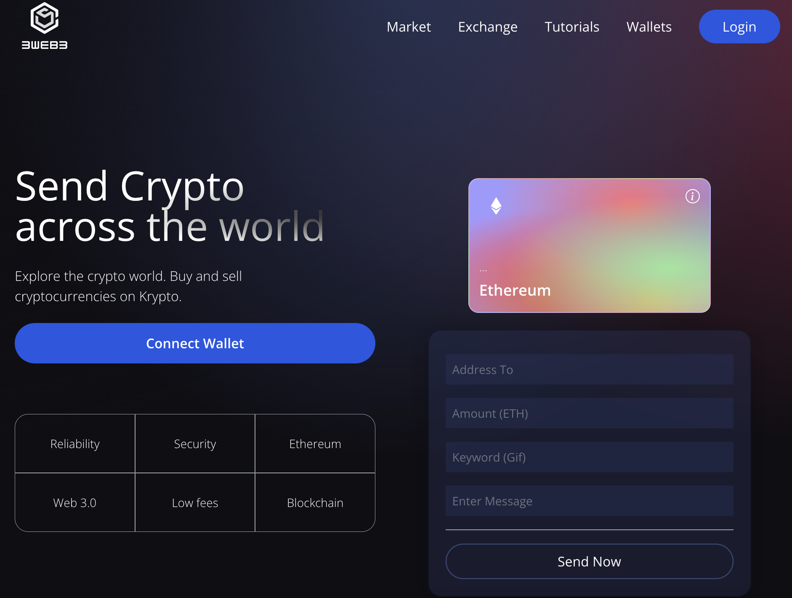

# 3Web3

This is an application to send ETH across the world!

# Getting started

Make sure you have `npm` installed.

# Installation

1. Clone this repo by running `git clone https://github.com/andresolive/3Web3.git`
2. Install the dependencies by running `npm install`
3. From the project's root folder, cd into client by running `cd client`
4. Run `npm run dev`
5. You will find the application running in the browser!

# Tech stack
React, Solidity, Tailwind CSS.

*This project was built following a tutorial on Solidity + React.